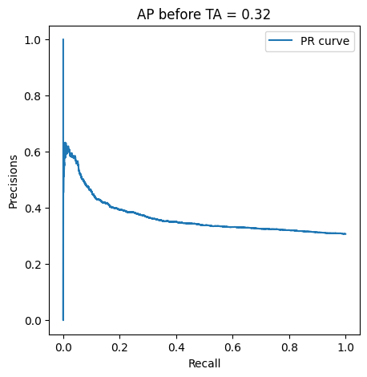
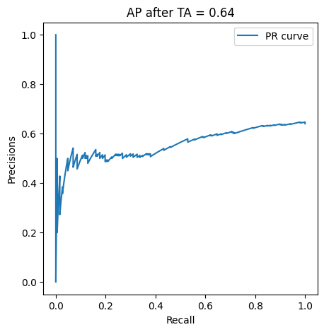
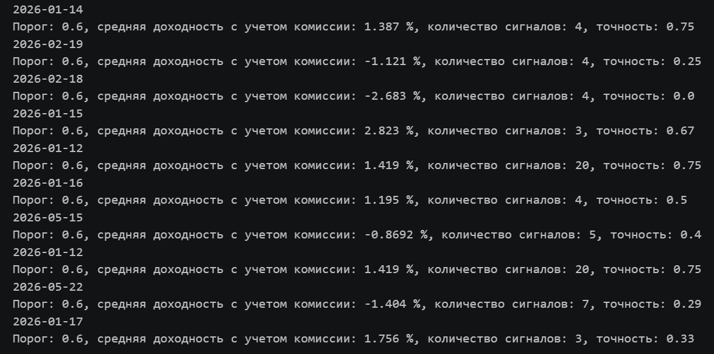
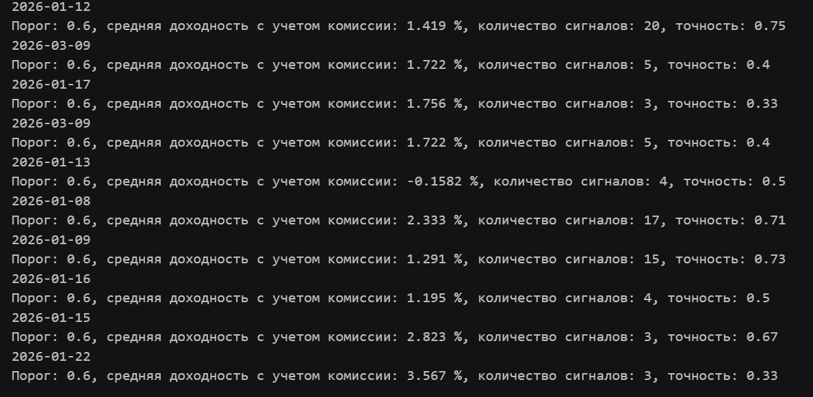
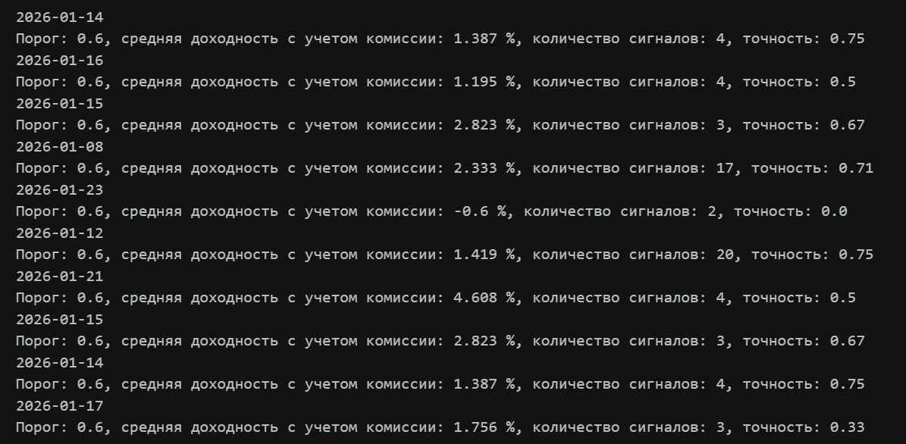

# stocks_analyser

Приложение для автоматического поиска торговых сигналов __в горизонте 7 дней__: определяет вероятный рост цены в ближайшее время с помощью машинного обучения и классических индикаторов технического анализа.

### Важное ограничение

1. [Доступ к данным осуществляется через API Т‑Инвестиций: требуется счёт и токен](https://www.tbank.ru/invest/settings/api/)
2. Если вы решите воспользоваться этой системой, помните: она протестирована только на исторических данных и не гарантирует будущей доходности. Все риски вы берёте на себя.
3. Если вы всё же хотите использовать систему, обратите особое внимание на горизонт прогноза — __7 дней__. Если за это время роста не произойдёт, прогноз считается неисполнившимся.

---

## Структура проекта

* [candle_formation_to_csv.ipunb](candle_formation_to_csv.ipynb) - Блокнот формирует CSV‑файлы со свечными данными (OHLCV) для обучения моделей; готовые файлы сохраняются в папке data/.
* [ml_model.ipynb](ml_model.ipynb) - Блокнот реализует полный ML‑цикл: подготовка данных, расчёт признаков на свечах, обучение RandomForest с балансировкой классов, оценка по AP, сохранение модели в .joblib
* [prediction.ipynb](prediction.ipynb) - Блокнот генерирует актуальные сигналы.
* [utils.py](utils.py) - Содержит вспомогательные функции.
* [requierements.txt](requierements.txt) - Список используемых библиотек
* __stocks_analyser_tickers_dv_with_model.joblib__ - Файл содержит список тикеров, обученный векторизатор и финальную ML‑модель.
---

## Запуск проекта

1. Установить Python.
2. Скопировать репозиторий. В терминале прописать "__git clone https://github.com/ChtoGde/stocks_analyser.git__".
3. Выбрать директорию проекта "__cd 'путь к папке'__".
4. Создать виртуальную среду "__python -m venv venv__".
5. Установит необходимые библиотеки "__pip install -r requirements.txt__".
6. Открыть блокнот "__prediction.ipynb__".
7. В ячейке, где переменная "__TOKEN = __" ввести ваш токен от Т-инвестиций и запустить код.
8. В последней ячейке будут показаны рекомендации.

---

## Оценка модели

Ось Y (Precision) отражает точность прогноза: долю действительно перспективных акций среди тех, что модель включила в выборку.
Ось X (Recall) показывает полноту охвата - какая доля всех по-настоящему перспективных акций была найдена моделью.

Чем выше порог уверенности модели (то есть чем строже критерий отбора), тем реже акции попадают в прогноз: Recall снижается и стремится к 0, а Precision, напротив, растёт — за счёт того, что в выборку попадают только наиболее надёжные кейсы.

Наша задача — найти оптимальный порог, при котором достигается баланс: Precision остаётся на уровне, достаточном для прибыльности стратегии, а Recall не опускается слишком низко, чтобы не упускать значимую часть потенциально доходных акций. Это соответствует поиску точки на PR‑кривой непосредственно перед тем участком, где Precision начинает резко падать при небольшом росте Recall.

Оценка тестовой выборки данных до фильтрации с использованием технического анализа.

Оценка тестовой выборки данных после фильтрации с использованием технического анализа.

Анализ результатов показывает: лучший прогноз получается именно при совмещении технического анализа и ML - так модель точнее отделяет сильные сигналы от рыночного шума.

---

## Расчёт доходности сигналов на выборке случайных дней

В ходе бэктеста оценивалась эффективность ML‑сигналов на отдельных торговых днях. Для всех тестов использовался фиксированный порог отсечения 0.6. По каждой дате приведены: средняя доходность с учётом комиссий, количество сгенерированных сигналов, а также точность предсказаний.

---

## Дальнейшие шаги для повышения эффективности

* Добавление NLP‑признаков тональности новостей по каждой акции.
