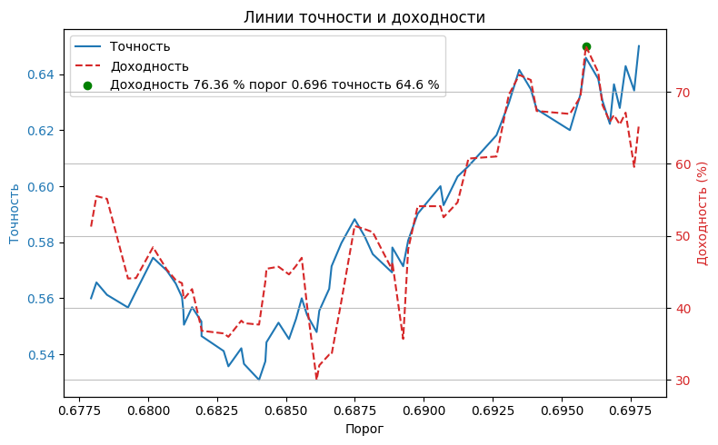

# stocks_analyser

Приложение для автоматического поиска торговых сигналов __в горизонте 7 дней__: определяет вероятный рост цены в ближайшее время с помощью градиентного бустинга.

### Важное ограничение

1. [Доступ к данным осуществляется через API Т‑Инвестиций: требуется счёт и токен](https://www.tbank.ru/invest/settings/api/).
2. Если вы решите воспользоваться этой моделью, помните: она протестирована только на исторических данных и не гарантирует будущей доходности. Все риски вы берёте на себя.
3. Если вы всё же хотите использовать модель, обратите особое внимание на горизонт прогноза — __7 дней__. Если за это время роста не произойдёт, прогноз считается неисполнившимся. В качестве рекомендации при покупке выставляйте тейк‑профит на уровне 2–3 % и стоп‑лосс на уровне −1 %.

---

## Структура проекта

* [candle_formation_to_csv.ipunb](candle_formation_to_csv.ipynb) - Блокнот формирует CSV‑файлы со свечными данными (OHLCV) для обучения моделей; готовые файлы сохраняются в папке data/.
* [ml_model.ipynb](ml_model.ipynb) - Блокнот реализует полный ML‑цикл: подготовка данных, расчёт признаков на свечах, обучение RandomForest с балансировкой классов, оценка по AP, сохранение модели в .joblib
* [prediction.ipynb](prediction.ipynb) - Блокнот генерирует актуальные сигналы.
* [utils.py](utils.py) - Содержит вспомогательные функции.
* [requierements.txt](requierements.txt) - Список используемых библиотек
* __stocks_analyser_tickers_dv_with_model.joblib__ - Файл содержит список тикеров, обученный векторизатор и финальную ML‑модель.
---

## Запуск проекта

1. Установить Python.
2. Скопировать репозиторий. В терминале прописать "__git clone https://github.com/ChtoGde/stocks_analyser.git__".
3. Выбрать директорию проекта "__cd 'путь к папке'__".
4. Создать виртуальную среду "__python -m venv venv__".
5. Установит необходимые библиотеки "__pip install -r requirements.txt__".
6. Открыть блокнот "__prediction.ipynb__".
7. В ячейке, где переменная "__TOKEN = __" ввести ваш токен от Т-инвестиций и запустить код.
8. В последней ячейке будут показаны рекомендации.

---

## Оценка модели

### На графике:

Ось X - это порог (threshold): точка, где вероятность превращается в решение "покупать/не покупать".
Ость Y - Две линии на графике, наш баланс сил: синяя - точность (чем выше, тем реже ошибаемся), красная пунктирная - доходность (чем выше, тем больше зарабатываем).

Наша задача - поймать золотую середину: подобрать такой порог, чтобы точность оставалась на уверенном уровне, а доходность не проседала.
Чтобы не скатиться в излишнюю консервативность, было задано ограничение - минимум 50 сигналов. Это держит стратегию в рабочем ритме: она не замирает в ожидании "идеальных" условий, а продолжает генерировать решения.

Путём тестирования была найден оптимальный порог в 0.529 пунктов, который даёт доходность сигналов 28.5% при точности 66.7%

---

## Дальнейшие шаги для повышения эффективности

* Добавление NLP‑признаков тональности новостей по каждой акции.
